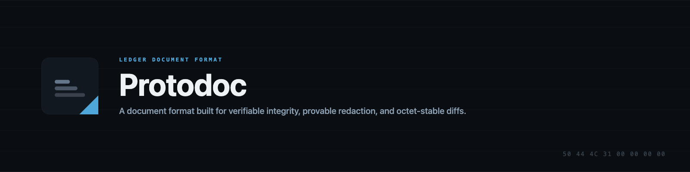

# Protodoc

A document format designed from scratch, plus its reference implementation. Not compatible with OOXML/PDF and
not intended to be — it exists to make properties those formats cannot guarantee into checkable facts about the
file itself.

## Why

Word-family formats (OOXML) repack the whole file on every save and let signatures cover an enumerated subset
the signer chooses; PDF stores rendered layout instead of content and lets appended, unsigned octets render
anyway. Both leak deleted content and identity through provenance surfaces nobody can fully enumerate, and both
have essentially one complete implementation each after decades. Protodoc's bet: a format where

- **saving costs octets proportional to the edit**, not the file size (real diffs, real git history),
- **a signature covers everything a reader can act on**, or says exactly what it doesn't,
- **redaction is provably total**, not "mostly removed,"
- **annotations survive concurrent editing** because they're anchored to identity, not character offsets,
- **two independent implementations produce byte-identical output** on the same input, always,

are structural guarantees, not aspirations. Full case: [`specs/001-protodoc-format-core/spec.md`](specs/001-protodoc-format-core/spec.md) § 1-2.

## Status

Implementation is done and green (`go build/vet/test ./...` passes across the whole reference implementation).
All specs (phases 0-5) are approved and frozen. Two things remain before v1 can be declared stable:

- **A second, genuinely independent implementation** of the container/validate/canonicalization layers, built
  by someone with no access to this repository's source, to prove the specification is unambiguous rather than
  just internally consistent. Looking for a volunteer — open an issue on this repo if you're interested.
- **Format registration** with IANA (`application/vnd.protodoc` media type) and PRONOM (file-signature
  registry) — both submitted, currently awaiting review.

See [`specs/001-protodoc-format-core/analysis.md`](specs/001-protodoc-format-core/analysis.md) and
[`specs/CHANGES.md`](specs/CHANGES.md) for the full, git-verified breakdown.

| Artifact | What it is |
|---|---|
| [`.specify/memory/constitution.md`](.specify/memory/constitution.md) | 14 non-negotiable project principles (v0.2.0) |
| [`specs/001-protodoc-format-core/spec.md`](specs/001-protodoc-format-core/spec.md) | 197 requirements, EARS notation, WHAT/WHY only |
| [`specs/001-protodoc-format-core/clarify.md`](specs/001-protodoc-format-core/clarify.md) | 17 resolved design-fork decisions |
| [`specs/001-protodoc-format-core/plan.md`](specs/001-protodoc-format-core/plan.md) | Chosen architecture, HOW |
| [`specs/001-protodoc-format-core/research.md`](specs/001-protodoc-format-core/research.md) | 5 competing architectures, why one won |
| [`specs/001-protodoc-format-core/data-model.md`](specs/001-protodoc-format-core/data-model.md) | Entities, fields, ceilings, ordering rules |
| [`specs/001-protodoc-format-core/contracts/`](specs/001-protodoc-format-core/contracts/) | Normative wire grammars (ABNF) + CLI contract |
| [`specs/001-protodoc-format-core/tasks.md`](specs/001-protodoc-format-core/tasks.md) | 19 milestones, 372 implementation tasks |
| [`specs/001-protodoc-format-core/analysis.md`](specs/001-protodoc-format-core/analysis.md) | Phase 5 cross-artifact consistency, gate PASSES |
| [`scripts/extract_milestone_tasks.py`](scripts/extract_milestone_tasks.py) | Regenerates the per-milestone task breakdown + real topological build order from `tasks.md` |
| [`docs/cli-usage-guide.md`](docs/cli-usage-guide.md) | How to build and run the `protodoc` CLI, with known-issue caveats |

## The architecture in one paragraph

**Protodoc Ledger (PDL)**: a fixed 1 MiB prefix (magic header, a self-digesting 7-slot commit ring, a
16,384-slot segment table) followed by an append-only ledger of sealed segments. Two Merkle trees over the
content — a storage-integrity tree and a content-commitment tree — feed one signed root, so signature coverage
is a structural property of the tree rather than a list the signer has to get right. Text has per-character
identity (minted once, never reissued, run-merged for size) instead of offsets, so annotations and edits from
different collaborators reconcile deterministically instead of racing. Everything structured is encoded with a
bespoke deterministic TLV grammar (byte-lexicographic canonical order, no floats, no ambiguous forms) rather
than protobuf, because proto3 does not guarantee identical canonical bytes across independent implementations
and this format's signing story depends on that guarantee. Full detail, every rejected alternative, and why:
[`plan.md`](specs/001-protodoc-format-core/plan.md) and [`research.md`](specs/001-protodoc-format-core/research.md).

## Repo layout

```
.specify/memory/constitution.md   Governing principles (read before any design or code decision)
specs/001-protodoc-format-core/   The full spec-to-tasks-to-analysis pipeline (see table above)
scripts/extract_milestone_tasks.py  Regenerates .impl_tasks/ (gitignored) from tasks.md
pkg/pdlfmt/                       PDL-VARINT, PDL-TLV, and value-kind wire primitives — done (M01)
pkg/container/                    Header, CommitRingRecord, Frontmatter, SegmentTableSlot — done (M01)
pkg/ledger/                       Ledger & Placement — done (M02)
pkg/content/, pkg/content/mint/   Identity & Anchor — done (M04)
pkg/extract/                      Extraction — done (M05)
pkg/eddsa/                        Signature Primitive (EdDSA-Protodoc-1) — done (M06)
pkg/integrity/                    Integrity Trees (T_S/T_C) — done (M08)
pkg/validate/                     Structural Validation Core — done (M07)
                                  Extensibility Envelope — done (M03)
                                  Signature & Coverage — done (M09)
                                  Attestation Evidence & LTV — done (M10)
pkg/history/                      Redaction, History & Erasure — done (M11, M12)
pkg/merge/                        Concurrent-Edit / Merge — done (M13)
pkg/render/                       Rendering & Resource — done (M14)
pkg/semantics/                    Accessibility & Semantic Content-Model Extensions — done (M15)
pkg/migrate/, pkg/registry/       Evolution / Migration & Registry — done (M16)
pkg/canon/                        Canonicalization — done (M17)
pkg/cli/                          CLI Surface — done (M18)
pkg/governance/, pkg/traceability/, pkg/diffconform/, pkg/fuzzmaturity/, pkg/benchconfig/, pkg/ceilings/
                                  Conformance, Fuzzing & Governance Convergence (M19) — the second-
                                  implementation and registry-filing gates described above live here
cmd/                              CLI entry points for the packages above
go.mod                            Go 1.25 module
```

## Stack

- **Go 1.25**, standard library only in the reference implementation — zero third-party dependencies
  (`go.mod` has no `require` block), per constitution principle CP-010. Cross-compilation targets:
  darwin, linux, windows on amd64 and arm64.
- **Cryptography**: unmodified stdlib `crypto/ed25519` for signing (wrapped by a 7-step
  canonical/small-order-rejecting verification procedure, `pkg/eddsa`) and `crypto/sha256` for every
  Merkle-tree and commitment digest. No third-party curve or hashing library.
- **Wire format**: a bespoke deterministic TLV encoding (`pkg/pdlfmt`) and a Bitcoin-CompactSize-style
  varint — no protobuf, no third-party serialization library (see `research.md` §3 for why protobuf
  was rejected).
- **Specification**: Markdown for prose (`spec.md`, `plan.md`, etc.) and ABNF for normative wire
  grammars (`contracts/*.abnf`), following the Spec-Driven Development (SDD) methodology throughout
  (`.specify/memory/constitution.md`).
- **Tooling**: Python 3 for `scripts/extract_milestone_tasks.py` (mechanical task-list regeneration,
  no runtime dependency on the Go module); The National Archives' DROID/sigtool for verifying the
  PRONOM file-signature submission against a real generated sample.
- **Version control and hosting**: Git, GitHub (issues, Pages for the public spec URL), the `gh` CLI
  for repository and registration workflows.

## Acknowledgments

Protodoc went from an idea scribbled in a worn-out notebook to a frozen, cross-referenced spec and a
working, tested Go reference implementation almost entirely through AI-assisted development, and
that's worth naming plainly rather than glossing over:

- **[Claude Code](https://claude.com/claude-code) and [Anthropic](https://www.anthropic.com/)** —
  drove the full spec-driven-development pipeline (constitution through analysis), the initial
  implementation milestone, and the ongoing governance/registration work on this repository.
- **[Kiro](https://kiro.dev/) (Amazon/AWS's agentic IDE)** — carried the bulk of the reference
  implementation (milestones M02 through M18) forward after a mid-project handoff, and the project
  would not be anywhere near this complete without that work.
- **[AWS](https://aws.amazon.com/)** — the underlying infrastructure Kiro runs on.
- **[GitHub](https://github.com/)** — hosting, issue tracking, and the `gh` CLI used throughout for
  repository and registration work.
- **[The National Archives' PRONOM/DROID team](https://www.nationalarchives.gov.uk/pronom/)** and
  **[IANA](https://www.iana.org/)** — for the format-registration processes this project is
  currently going through.

Thank you to everyone building the tools that made a from-scratch, one-person format-design project
like this one actually tractable.
